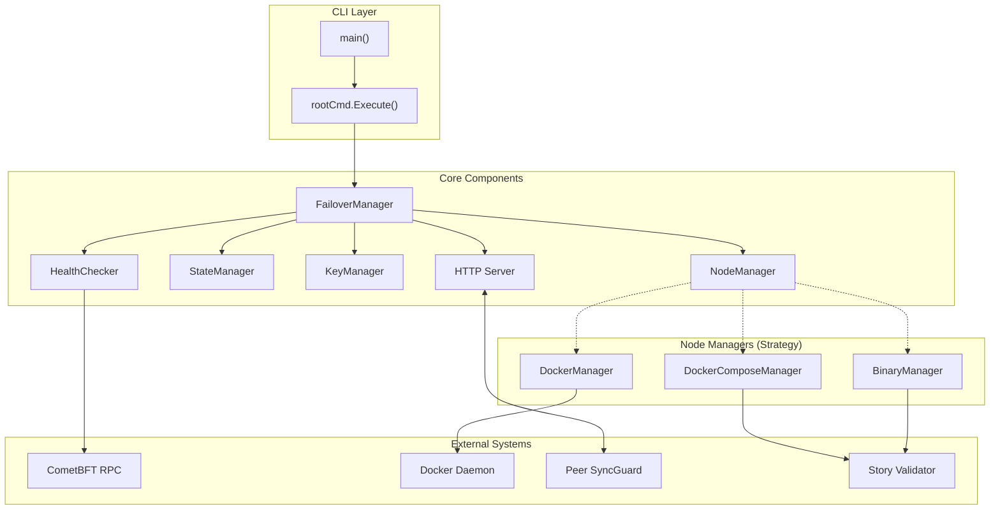

# Component Architecture

> How SyncGuard packages relate to each other and external systems.

```mermaid
graph TB
    subgraph CLI["CLI Layer"]
        main["main()"]
        rootCmd["rootCmd.Execute()"]
    end

    subgraph Core["Core Components"]
        FM["FailoverManager"]
        HC["HealthChecker"]
        SM["StateManager"]
        KM["KeyManager"]
        NM["NodeManager"]
        SRV["HTTP Server"]
    end

    subgraph Node["Node Managers (Strategy)"]
        BM["BinaryManager"]
        DM["DockerManager"]
        DCM["DockerComposeManager"]
    end

    subgraph External["External Systems"]
        COMET["CometBFT RPC"]
        DOCKER["Docker Daemon"]
        PEER["Peer SyncGuard"]
        STORY["Story Validator"]
    end

    main --> rootCmd
    rootCmd --> FM
    FM --> HC
    FM --> SM
    FM --> KM
    FM --> NM
    FM --> SRV

    NM -.-> BM
    NM -.-> DM
    NM -.-> DCM

    HC --> COMET
    DM --> DOCKER
    DCM --> STORY
    BM --> STORY
    SRV <--> PEER
```
