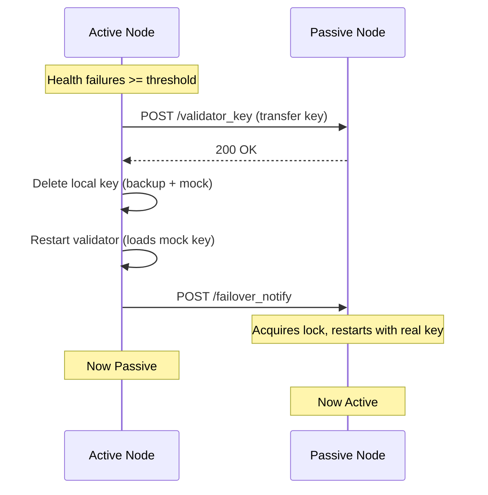
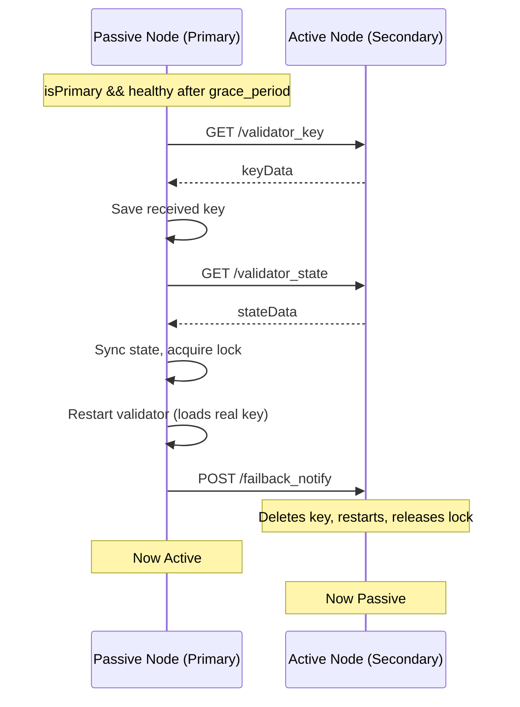

# Failover Lifecycle

> Peer-to-peer key handoff during failover and failback.

## Failover (Active → Passive)

Triggered when health check failures exceed `retry_attempts` threshold.

---

## Failback (Passive → Active)

Triggered when primary node recovers after `grace_period`.

