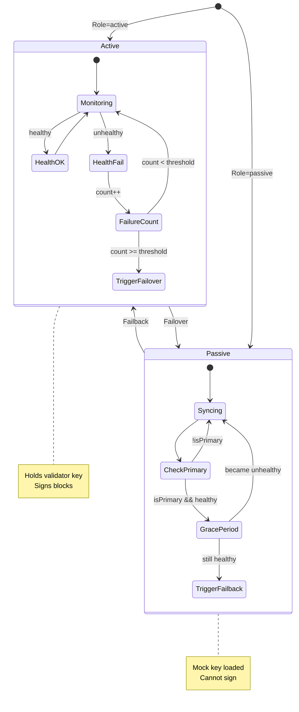

# State Machine

> High-level view of node state transitions.

```mermaid
stateDiagram-v2
    [*] --> Active : Role=active
    [*] --> Passive : Role=passive

    Active --> Passive : Failover
    Passive --> Active : Failback

    state Active {
        [*] --> Monitoring
        Monitoring --> HealthOK : healthy
        Monitoring --> HealthFail : unhealthy
        HealthOK --> Monitoring
        HealthFail --> FailureCount : count++
        FailureCount --> Monitoring : count < threshold
        FailureCount --> TriggerFailover : count >= threshold
    }

    state Passive {
        [*] --> Syncing
        Syncing --> CheckPrimary
        CheckPrimary --> GracePeriod : isPrimary && healthy
        CheckPrimary --> Syncing : !isPrimary
        GracePeriod --> TriggerFailback : still healthy
        GracePeriod --> Syncing : became unhealthy
    }

    note right of Active : Holds validator key<br/>Signs blocks
    note right of Passive : Mock key loaded<br/>Cannot sign
```
