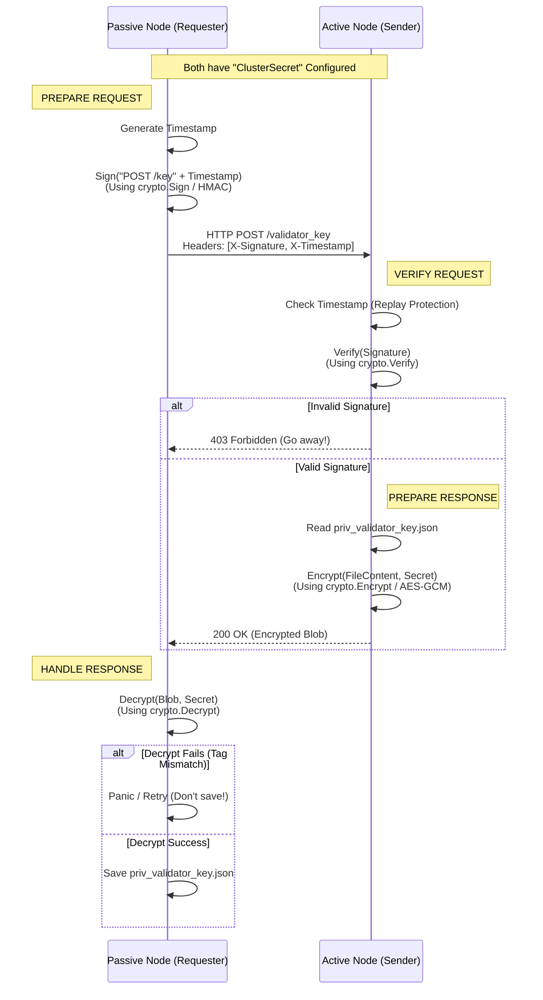

# Secure Validator Key Transfer Protocol

This diagram illustrates the authenticated and encrypted transfer of the `priv_validator_key.json` file between nodes.

```mermaid
sequenceDiagram
    participant Passive as Passive Node (Requester)
    participant Active as Active Node (Sender)
    
    Note over Passive, Active: Both have "ClusterSecret" Configured
    
    %% Step 1: Authentication (The Bouncer)
    Note left of Passive: PREPARE REQUEST
    Passive->>Passive: Generate Timestamp
    Passive->>Passive: Sign("POST /key" + Timestamp)<br/>(Using crypto.Sign / HMAC)
    Passive->>Active: HTTP POST /validator_key<br/>Headers: [X-Signature, X-Timestamp]

    %% Step 2: Verification (The Check)
    Note right of Active: VERIFY REQUEST
    Active->>Active: Check Timestamp (Replay Protection)
    Active->>Active: Verify(Signature)<br/>(Using crypto.Verify)
    
    alt Invalid Signature
        Active-->>Passive: 403 Forbidden (Go away!)
    else Valid Signature
        %% Step 3: Encryption (The Lock)
        Note right of Active: PREPARE RESPONSE
        Active->>Active: Read priv_validator_key.json
        Active->>Active: Encrypt(FileContent, Secret)<br/>(Using crypto.Encrypt / AES-GCM)
        Active-->>Passive: 200 OK (Encrypted Blob)
    end

    %% Step 4: Decryption (The Unlock)
    Note left of Passive: HANDLE RESPONSE
    Passive->>Passive: Decrypt(Blob, Secret)<br/>(Using crypto.Decrypt)
    alt Decrypt Fails (Tag Mismatch)
        Passive->>Passive: Panic / Retry (Don't save!)
    else Decrypt Success
        Passive->>Passive: Save priv_validator_key.json
    end
```
