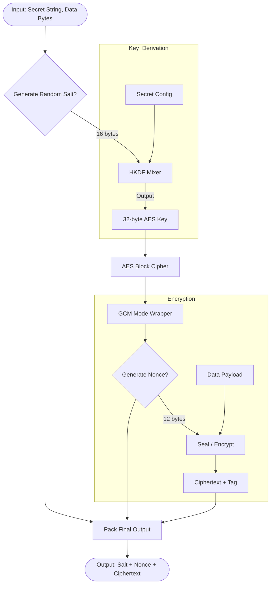

# Symmetric Encryption Flow (AES-256-GCM)

```mermaid
flowchart TD
    Start([Input: Secret String, Data Bytes]) --> Salt{Generate Random Salt?}
    Salt -->|16 bytes| mix[HKDF Mixer]
    
    subgraph Key_Derivation
    Secret[Secret Config] --> mix
    mix -->|Output| Key[32-byte AES Key]
    end

    Key --> Block[AES Block Cipher]
    Block --> GCM[GCM Mode Wrapper]
    
    subgraph Encryption
    GCM --> Nonce{Generate Nonce?}
    Nonce -->|12 bytes| Seal[Seal / Encrypt]
    Data[Data Payload] --> Seal
    Seal --> Encrypted[Ciphertext + Tag]
    end

    Salt --> Pack[Pack Final Output]
    Nonce --> Pack
    Encrypted --> Pack
    
    Pack --> Result([Output: Salt + Nonce + Ciphertext])
```
